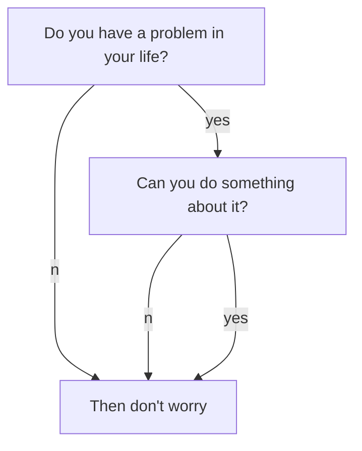

Dark Mode is cool, and TeXt is supporting it.

If you like TeXt, don't forget to give me a star. 
If you see this page, that means you have setup your site. enjoy! :ghost: :ghost: :ghost: You may want to config the site or writing a post next. Please feel free to create an issue or send me email if you have any questions.
If you see this page, that means you have setup your site. enjoy! :ghost: :ghost: :ghost: You may want to config the site or writing a post next. Please feel free to create an issue or send me email if you have any questions.

<!--more-->

Dark Mode is cool, and TeXt is supporting it.

If you like TeXt, don't forget to give me a star. 

It is developing on `dev` branch, you can run `git checkout dev` to switch to this branch.

For now, ONLY `default` skin supports Dark Mode.

The security component
The Security component is divided into several smaller

security-core : the common security features like authorization, authentication, encoding passwords and users loading.
security-http: integrates the core with http response and requests.
security-csrf: protection from the csrf attacs.
security-guard: layers of authentications together to allow more complex authentication steps.

# Security - core
## User
inside the security-core directory there is the User directory, it has the following interfaces

UserInterface: all user classes must implement this it has the basic user info like the getPassword, getUsername and getRoles methods.
AdvancedUserInterface: @deprecated — it adds some more features to check the user status like if its locked or not.
UserCheckerInterface: Can be used when you want to check the account status.
EquatableInterface: is $this->user equals the other user?
UserProviderInterface: mainly to be used by some provider to provide the class with the user. @TODO: understand the difference between UserProviderInterface and UserAuthenticationProvider under provider/authentication.
Authenitcation
Authorization
The very first thing you will hear about when it comes to authorizaing the users is voters. voters are called when you call isGranted() or denyAccessUnlessGranted() Exception There are many exceoptions available out of the box, you can choose from the following depending on your status:

AccessDeniedException AccountExpiredException which implements AccountStatusException. AuthenticationCredentialsNotFoundException and many others available in the security-core/User directory.

side notes for me as an oop newbie,

symfony is mainly providing so many interfaces that you can use later like the user interface with it’s methods and specifies if it’s a throwing an exception or not.

<!--  some custom styling. -->
