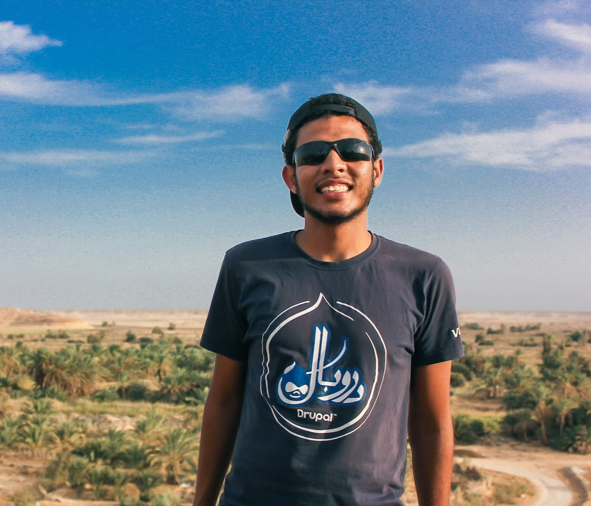

{:.rounded .shadow}

```javascript
echo 'Hello world!';
```

I'm Ahmed Ayman, a software developer at <span style="color:red"> [Vodafone international services](https://www.vodafone.com.eg/vodafoneportalWeb/en/P19201651461361728062647)</span>. I do work there as a Drupal Developer. I have been working as a drupal developer for over two years now beside with other php projects like **Symfony** and **Magento**.

Beside the work I do train for the triathlon. I love cycling, swimming and running. 

I'm also an avid traveler, arts lover and a computer video games amateur. 

### Open source 

Most of my work is actually involved with the open source softwares, I do contribute and learn about open source softwares almost all of my time.

I do contribute to [drupal.org](https://www.drupal.org/)  by building and fixing issues for contributed modules.

my biggest contribution so far has been the (entity visitors module](https://www.drupal.org/project/entity_vistiors) which is providing a sort of similar functionality to the linkedin's "people who visited your profile" block. 

I also love contributing to the open source communities on github.

and currently I'm learning about Symfony components and how to use it to be such a genius software engineer.

### My career path

I've started my career really early during my college time here's a very short summary about it: 

- [2015] in my first year of college I started working as a customer care agent at Vodafone Egypt mainly to get some cash and buy my first ever laptop.  
- [2016] after my second year of college I started working at [creative bits](https://creative-bits.org/) as teacher assistant where I was teaching kids about robotics and programming concepts.
- [2017] after my third year I got a machine learning internship at [Smartcom-eg](https://www.linkedin.com/company/smartcom4st/about/) for two months then worked with them as a full-time data analyst for another month.
- [2017 & 2018 ] during my fourth year of college I started working for  [Motoon](https://motoon.org) as a drupal developer.
- [2019 until april ] I started working at Robusta studio as a web developer (E-commerce using Magento).
- [May 2019 - present] started working at vodafone once again as a Drupal developer.

